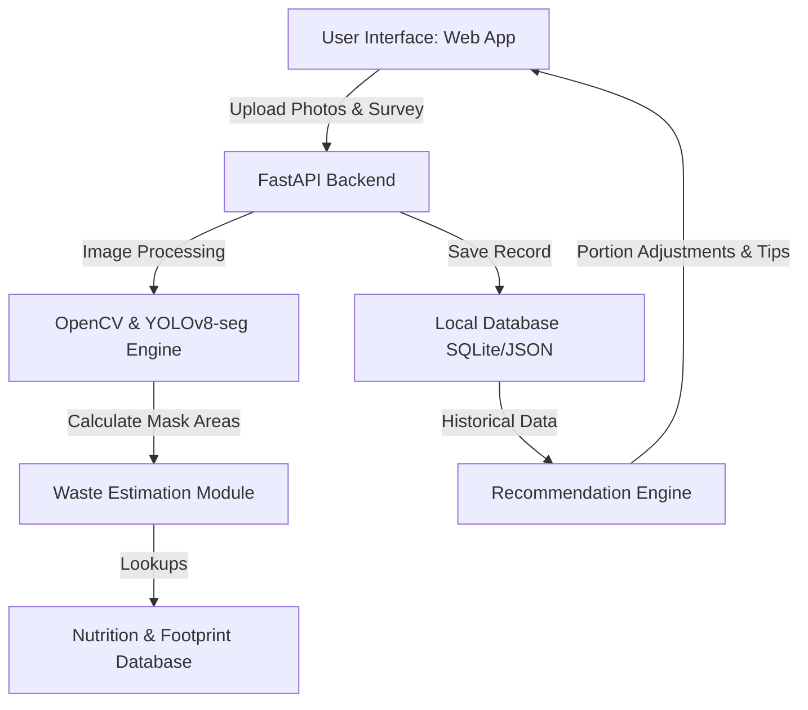

# Project Implementation Plan: Smart Food Waste Estimator & Recommender

This document outlines the architectural design, technical strategies, and developmental roadmap for building the Smart Food Waste Estimator tool.

---

## 1. Project Vision & Architecture

The application will allow users to upload "before" and "after" photos of their meal. Using computer vision (YOLOv8 Segmentation + OpenCV), the tool will isolate food items, measure the consumed vs. leftover area, calculate wasted mass, assess nutritional and environmental impact, and provide tailored portion sizing and leftover storage strategies.

### High-Level Architecture


---

## 2. Technical Component Design

### A. Computer Vision Pipeline (OpenCV & YOLO11-seg Food-Fine-Tuned)
Instead of standard object detection bounding boxes, we will use a fine-tuned **YOLO11 food instance segmentation model** (`arunapb/yolo11l-food-segmentation` from Hugging Face). Bounding boxes are insufficient for estimating exact volume/area, whereas instance segmentation provides pixel-level mask matrices for specific food categories, enabling us to identify and segment 103 detailed ingredients out-of-the-box.

1. **Plate & Bowl Detection**: Isolate the primary container to define the boundaries of the food.
2. **Food Mask Extraction**: 
   - Detect food types (pre-trained categories include pizza, sandwich, hot dog, broccoli, carrot, donut, cake, bowl, etc., or general "food" regions).
   - Sum the number of active mask pixels for each detected food item in the **Before** image ($A_{\text{before}}$).
   - Sum the active mask pixels for the same item in the **After** image ($A_{\text{after}}$).
3. **Leftover Estimation**:
   $$\text{Leftover \%} = \frac{A_{\text{after}}}{A_{\text{before}}} \times 100\%$$
   *Note: If the camera angle changes slightly between shots, we can use OpenCV feature alignment (ORB/homography) or normalize food areas relative to the container/plate's pixel size.*

### B. Nutrition & Environmental Footprint Engine
We will establish standard portion sizes, nutritional profiles, and environmental footprints for common food classes.

| Food Category | Standard Portion Size | Calories (per 100g) | Protein/Carbs/Fat (g/100g) | CO2 Footprint (kg CO2e per kg) |
| :--- | :--- | :--- | :--- | :--- |
| **Grains / Rice** | 180g | 130 | 2.7 / 28 / 0.3 | ~1.5 (Medium) |
| **Meats / Proteins** | 150g | 250 | 26 / 0 / 15 | ~27.0 (High) |
| **Vegetables** | 100g | 25 | 1.5 / 5 / 0.2 | ~0.5 (Very Low) |
| **Pasta / Noodles** | 200g | 158 | 5.8 / 31 / 0.9 | ~1.8 (Medium) |
| **Pizza / Dairy** | 250g | 266 | 11 / 33 / 10 | ~8.0 (High) |

**Waste Weight & Metric Formulas**:
- $\text{Estimated Wasted Weight (g)} = \text{Standard Portion Size} \times \text{Leftover \%}$
- $\text{Calories Wasted} = \text{Estimated Wasted Weight} \times \frac{\text{Calories}}{100\text{g}}$
- $\text{CO2 Impact (kg CO2e)} = \text{Estimated Wasted Weight (kg)} \times \text{CO2 Footprint Factor}$

### C. Database Schema (SQLite Relational SQL Database)
To track long-term waste patterns and provide custom intelligence, we will use SQLite as a standard relational SQL database. We will log each meal entry:
```sql
CREATE TABLE meal_logs (
    id INTEGER PRIMARY KEY AUTOINCREMENT,
    timestamp DATETIME DEFAULT CURRENT_TIMESTAMP,
    food_category TEXT,
    before_photo_path TEXT,
    after_photo_path TEXT,
    leftover_percentage REAL,
    wasted_weight_grams REAL,
    calories_wasted REAL,
    co2_wasted_kg REAL,
    hunger_before INT,        -- Survey: 1 to 10
    taste_enjoyment INT,      -- Survey: 1 to 10
    reason_leftover TEXT      -- Survey: too full, too big portion, etc.
);
```

### D. Smart Recommender System
1. **Portion Recommender**:
   - If the user consistently leaves food in a specific category (e.g., leaving $>25\%$ of Grains over the last 3 logs), calculate their average leftover percentage: $L_{\text{avg}}$.
   - Recommend a portion reduction: "Next time, reduce your Grains serving size by $L_{\text{avg}}\%$ to match your actual consumption."
2. **Leftover Strategy**:
   - Detect why they left it. If "too full" or "no time," recommend a storage and preservation strategy: "Store lasagna in an airtight container; it stays good for 4 days or can be frozen for up to 3 months."
   - If "didn't taste good," offer simple seasoning/repurposing tips: "Add a splash of lime and chili powder to revive dry leftover chicken."

---

## 3. User Interface Strategy

We want a premium, stunning design that immediately wows the user. We have two implementation routes:

### Option A: Custom HTML/CSS/JS + FastAPI/Flask Backend (Recommended)
- **Why**: Allows complete styling control (custom font imports, dark-mode, glassmorphism, animated card entries, smooth drag-and-drop file uploaders, and interactive charts via Chart.js or Tailwind/Vanilla CSS styling).
- **Aesthetic**: Minimalist dark theme, glowing UI borders, real-time pixel-analysis progress animations, and interactive dashboards.
- **Complexity**: Slightly higher code overhead but produces an exceptionally high-fidelity result.

### Option B: Streamlit / Gradio Web Interface
- **Why**: Faster to implement, entirely written in Python.
- **Aesthetic**: Standard layout, clean, but less customizable styling.

---

## 4. Phase-by-Phase Roadmap

### Phase 1: Core Algorithm & CV Engine
- Download and integrate the fine-tuned `arunapb/yolo11l-food-segmentation` model from Hugging Face.
- Write the core image alignment and pixel estimation algorithms (`scripts/waste_estimator.py`).
- Implement nutrition, carbon footprint, and waste weight calculators.

### Phase 2: Database & Analytics Logic
- Create a data-handling module (`scripts/database.py`) to manage logs and perform statistical queries.
- Build the recommendation model (`scripts/recommender.py`) to process logs and generate portion tips.

### Phase 3: Web Application & UI Construction
- Build the FastAPI or Flask application server.
- Build the front-end page: drag-and-drop meal comparison dashboard, beautiful analytics, survey sliders, and real-time recommendations.
- Integrate interactive visualization charts showing consumption stats.

### Phase 4: Integration, Testing, & Final Polish
- Run end-to-end integration tests using local images.
- Refine detection and alignment robustness (handling rotation, scaling, and lighting).
- Add micro-animations, loading shimmers, and aesthetic enhancements.
